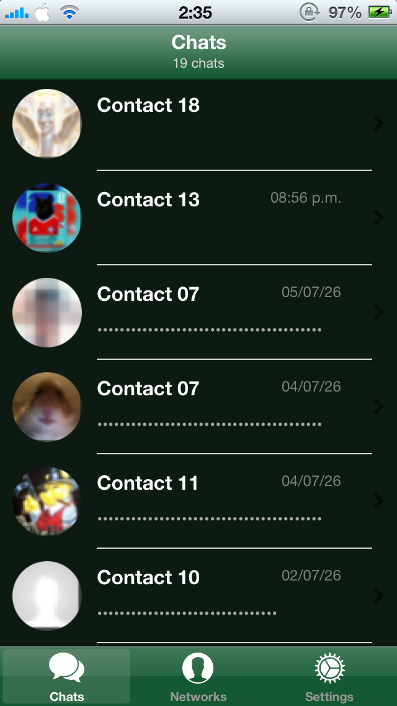
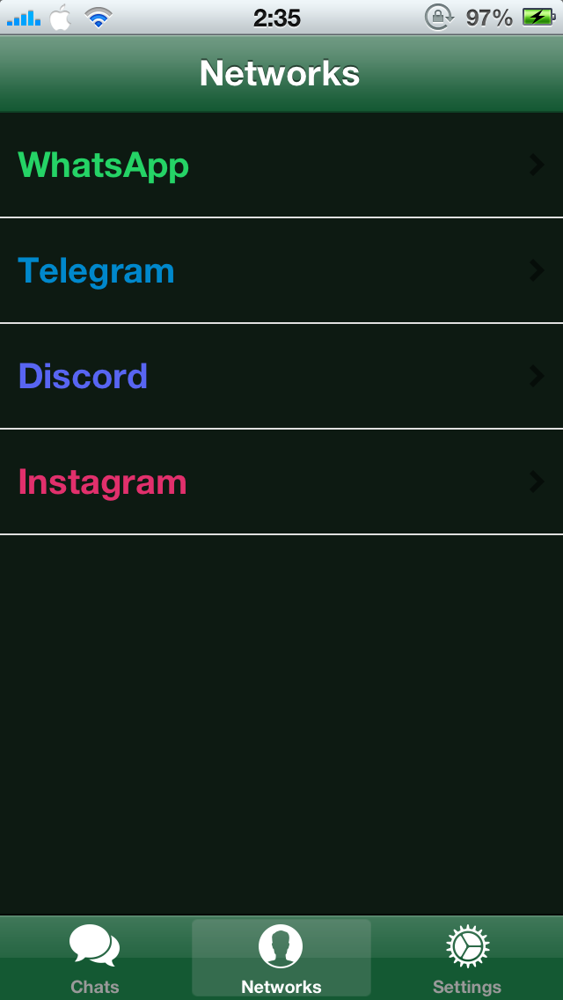
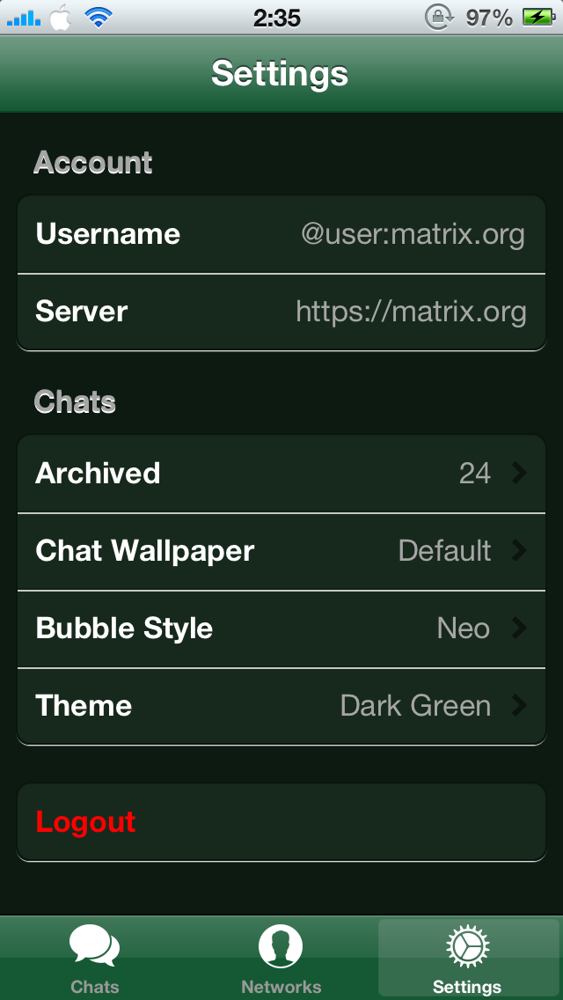

# Neo
### A Matrix client for iOS 6+

---

## The story

A few weeks ago I hosted my own Matrix homeserver, Synapse, plus mautrix bridges to pull WhatsApp, Telegram, Discord and Instagram into it, and started using Element X on my modern device.

Then one day I looked at my old iDevice and thought: *Is there any Matrix client out there like Element or FluffyChat?* No modern client installs on iOS 6, they all want iOS 12+ minimum.

So I made it. Neo was built around my own setup: my homeserver, my bridges, and once it actually started working, it felt silly not to share it.

This is not a serious, polished project. I just want to make the most out of what Matrix and Mautrix provide and use it on my old iDevice.

---

## Screenshots

<p align="center">
  
  
  
</p>

---

## What it does

- Log into any Matrix homeserver
- Room list with avatars, last message, timestamps, unread badges, swipe-to-archive
- Chat bubbles, grouped like a real messaging app, with date separators
- Send/receive images, voice messages, videos
- Edit and delete your own messages
- Emoji reactions
- Local notifications while the app's open or backgrounded
- Auto-detects mautrix bridge bots (WhatsApp/Telegram/Discord/Instagram) and sorts rooms into per-network tabs
- Local-only contact renaming, chat archiving
- Several bubble styles, custom wallpapers, a handful of light/dark themes

---

## What it doesn't do

- No push notifications when the app is fully closed
- No calls

---

## Building

```bash
git clone https://github.com/otcidor/Neo.git
cd Neo/MatrixClient
make package FINALPACKAGE=1 PACKAGE_FORMAT=ipa
```
